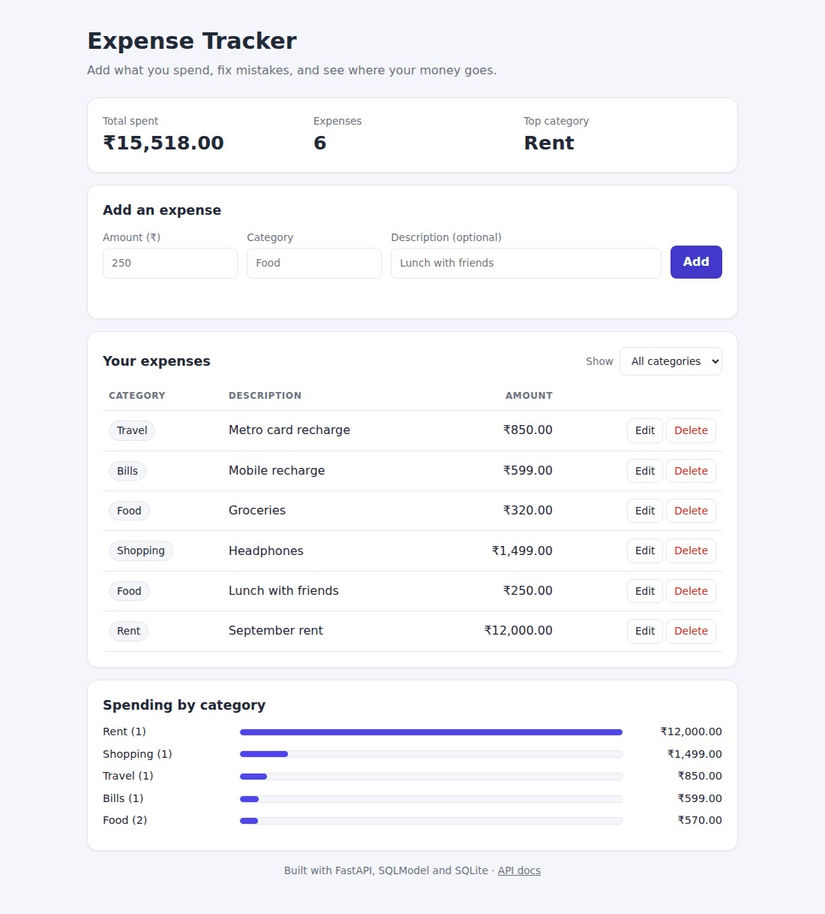

# 💸 Expense Tracker

[](https://github.com/VINAY-G-007/expense-tracker/actions/workflows/tests.yml)


[](LICENSE)

A full-stack expense tracker: a **REST API built with FastAPI and SQLModel**, a **SQLite database**, and a
**responsive web page** written in plain HTML, CSS and JavaScript (no frameworks, no build step).
Add what you spend, fix mistakes, filter by category and see where your money goes.



---

## ✨ Features

- **Full CRUD API:** create, list, read, update and delete expenses.
- **Spending summary:** total spent and totals per category (`GET /expenses/summary`).
- **Filter by category:** `GET /expenses?category=Food`.
- **Input validation:** amounts must be positive, categories can't be empty, text is trimmed and length-limited.
  Bad input gets a clear `422` error instead of being saved.
- **Clean web page:** add, edit, delete, filter, a spending-by-category chart, ₹ (INR) formatting,
  dark mode, and a layout that works on phones.
- **Safe by design:** the page never inserts user text as HTML (no cross-site scripting), and a double
  click can't save an expense twice.
- **Interactive API docs** at `/docs`, generated automatically by FastAPI.
- **Tested:** 26 pytest tests run against a throwaway database, plus GitHub Actions CI on Linux and Windows.
- **Deploy-ready:** runs on Render (or any Python host) with a single start command.

## 🧰 Tech stack

| Layer | Technology |
|---|---|
| Backend | Python 3.10+, FastAPI, SQLModel (SQLAlchemy + Pydantic) |
| Database | SQLite (any SQLAlchemy database via `DATABASE_URL`) |
| Frontend | HTML, CSS, vanilla JavaScript (Fetch API) |
| Testing | pytest, FastAPI `TestClient` |
| CI | GitHub Actions |

## 🚀 Run it locally

```bash
git clone https://github.com/VINAY-G-007/expense-tracker.git
cd expense-tracker

python -m venv venv
venv\Scripts\activate           # Windows
# source venv/bin/activate      # macOS / Linux

pip install -r requirements.txt
uvicorn main:app --reload
```

Then open **http://127.0.0.1:8000** for the app and **http://127.0.0.1:8000/docs** for the API docs.
The database file `database.db` is created automatically the first time the server starts.

## 🔌 API reference

| Method | Endpoint | What it does | Status codes |
|---|---|---|---|
| `GET` | `/` | The web page | 200 |
| `GET` | `/health` | Health check, returns `{"status": "ok"}` | 200 |
| `POST` | `/expenses` | Create an expense | 201, 422 |
| `GET` | `/expenses` | List expenses, oldest first. Optional `?category=Food` | 200 |
| `GET` | `/expenses/summary` | Total, count, and totals per category (largest first) | 200 |
| `GET` | `/expenses/{id}` | Get one expense | 200, 404 |
| `PUT` | `/expenses/{id}` | Replace an expense's amount, category and description | 200, 404, 422 |
| `DELETE` | `/expenses/{id}` | Delete an expense | 200, 404 |

**Expense fields**

| Field | Type | Rules |
|---|---|---|
| `amount` | number | greater than 0, at most 1,00,00,000 |
| `category` | text | 1 to 50 characters (spaces around it are removed) |
| `description` | text | optional, up to 200 characters |

**Examples** (with the server running; you can also use the **Try it out** buttons at `/docs`):

```bash
# Create an expense
curl -X POST http://127.0.0.1:8000/expenses -H "Content-Type: application/json" \
     -d '{"amount": 250, "category": "Food", "description": "Lunch"}'
# 201 → {"id": 1, "amount": 250.0, "category": "Food", "description": "Lunch"}

# Totals by category
curl http://127.0.0.1:8000/expenses/summary
# 200 → {"total": 1100.0, "count": 2, "by_category": [
#          {"category": "Travel", "total": 850.0, "count": 1},
#          {"category": "Food", "total": 250.0, "count": 1}]}

# Invalid input is rejected
curl -X POST http://127.0.0.1:8000/expenses -H "Content-Type: application/json" \
     -d '{"amount": -5, "category": "Food"}'
# 422 → {"detail": [{"type": "greater_than", "loc": ["body", "amount"],
#                    "msg": "Input should be greater than 0", ...}]}

# Unknown id
curl http://127.0.0.1:8000/expenses/99
# 404 → {"detail": "expense not found"}
```

On Windows PowerShell, the same "create" call looks like this:

```powershell
Invoke-RestMethod -Method Post -Uri http://127.0.0.1:8000/expenses -ContentType "application/json" `
  -Body '{"amount": 250, "category": "Food", "description": "Lunch"}'
```

## 🧪 Running the tests

```bash
pip install -r requirements-dev.txt
pytest
```

`tests/conftest.py` points the app at a temporary database, so running the tests never touches your real
`database.db`. The 26 tests cover every endpoint, the 404 cases, ten kinds of invalid input, text trimming and
the category summary. GitHub Actions runs them on every push: Python 3.10, 3.12 and 3.13 on Linux, and
Python 3.12 on Windows.

## ☁️ Deploying on Render

1. Push this repository to GitHub.
2. On [Render](https://render.com), create a **Web Service** from the repository.
3. **Build command:** `pip install -r requirements.txt`
4. **Start command:** `uvicorn main:app --host 0.0.0.0 --port $PORT`
5. Optional: set the **health check path** to `/health`.

> **Note:** on Render's free plan the disk is temporary, so SQLite data is wiped whenever the service
> restarts or redeploys. To keep data, create a Render PostgreSQL database, add `psycopg2-binary` to
> `requirements.txt`, and set the `DATABASE_URL` environment variable to the database's connection string.
> No code changes are needed.

## 🧠 How it works

- **One set of rules for the table and the request body.** `Expense` (the database table) and
  `ExpenseCreate` (what clients send) both inherit from `ExpenseBase`, so the validation rules are written once.
  `ExpensePublic` defines exactly what the API sends back.
- **A database session per request.** `get_session()` is a FastAPI dependency (`SessionDep`); FastAPI opens a
  session for each request and closes it afterwards.
- **Startup work in `lifespan`.** The table is created when the server starts, using FastAPI's `lifespan` handler.
- **Route order matters.** `/expenses/summary` is declared before `/expenses/{expense_id}`, otherwise FastAPI would
  try to read the word "summary" as an id.
- **Safe rendering.** The page talks to the API with `fetch()` and builds every row with `textContent`, so anything a
  user types is shown as plain text and never runs as code.

## 📁 Project structure

```text
expense-tracker/
├── main.py                # FastAPI app: models, database setup and all routes
├── index.html             # the web page (HTML + CSS + JavaScript)
├── requirements.txt       # app dependencies
├── requirements-dev.txt   # app + test dependencies
├── pytest.ini             # pytest settings
├── tests/
│   ├── conftest.py        # points the app at a temporary test database
│   └── test_main.py       # API tests
├── docs/
│   └── screenshot.png
├── .github/workflows/
│   └── tests.yml          # CI: runs the tests on every push
├── LICENSE
└── README.md
```

## 🗺️ Ideas for next steps

- A date for each expense, with monthly totals
- User accounts, so each person sees only their own expenses
- Export to CSV
- PostgreSQL on Render so data survives restarts

## 📄 License

[MIT](LICENSE) © 2026 Vinay G Jampannanavar
